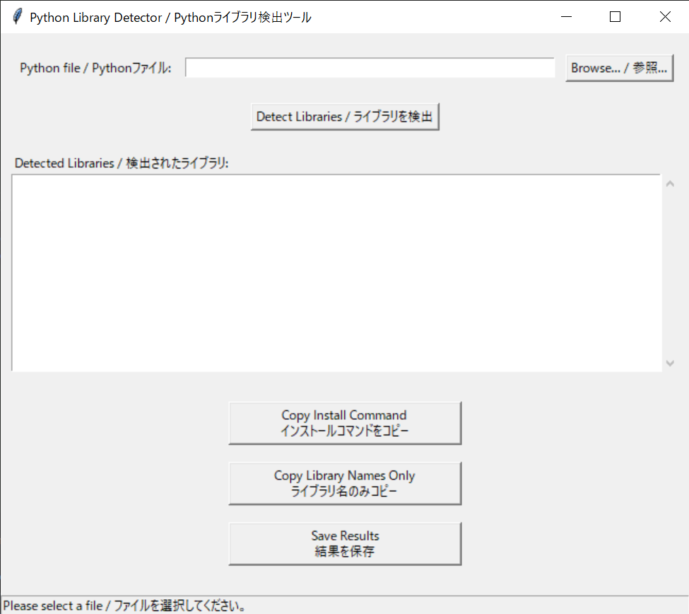

# Dependency Extractor / 依存関係抽出ツール

 [日本語](#japanese) | [English](#english) 

## 日本語 

Pythonファイルを実行する際に必要な外部ライブラリを事前に抽出するPythonツールです。インポート文を自動的に識別し、簡単にインストールするための要件を生成します。

### 特徴

- **静的解析**: Python の AST（抽象構文木）を使用してインポートされたライブラリを正確に検出
- **標準ライブラリ検出**: Python標準ライブラリと外部パッケージを自動的に区別
- **フォールバックパース**: AST解析が失敗した場合は正規表現パターンマッチングに切り替え
- **ユーザーフレンドリーなGUI**: Pythonファイルを選択して分析するためのシンプルなインターフェース
- **即時結果表示**: 検出されたライブラリを表示し、pipインストールコマンドを生成
- **コピーオプション**: 完全なインストールコマンドまたはライブラリ名のみをコピー可能
- **結果保存**: 結果をデスクトップのテキストファイルにエクスポート

### 使用方法

1. 参照ボタンを使用してPythonファイルを選択
2. 「ライブラリを検出」ボタンをクリックしてファイルを分析
3. インストールが必要な外部依存関係のリストを表示
4. コピーボタンを使用してインストールコマンドをクリップボードにコピー
5. 必要に応じて結果をテキストファイルに保存

### 使用例

- Pythonプロジェクトの環境設定準備
- アプリケーションをデプロイする前の依存関係の特定
- requirements.txtファイルの作成
- 必要なパッケージを含む仮想環境のセットアップ
- PyInstallerなどのツールでスタンドアロン実行ファイルを作成する前の準備

### インストール

インストールは不要です！。スクリプトをダウンロードしてPythonで実行するだけです：

```
python dependency-extractor.py
```

### 必要条件

- Python 3.6以上
- Tkinter（標準のPythonインストールに含まれています）

### 標準ライブラリ検出

このツールはPythonの標準ライブラリを自動的に検出し、依存関係リストから除外します。Python 3.6から3.13までの包括的な標準ライブラリリストを含んでいます：

- コアモジュール（os, sys, re, datetime など）
- データ構造とアルゴリズム（collections, heapq など）
- ファイル処理（pathlib, csv, json など）
- ネットワークとウェブモジュール（http, urllib, socket など）
- GUIモジュール（tkinter, turtle など）
- Python 3.11+ モジュール（tomli, asyncio.taskgroups など）
- Python 3.12+ モジュール（contextlib.chdir, pathlib.posixpath など）
- Python 3.13+ モジュール（expat, typing.assert_type など）
- 特殊モジュールと内部実装

---
## Screenshots / スクリーンショット

アプリケーションのメイン画面:



---

 [日本語](#japanese)
 
## English 

A Python tool that extracts required external dependencies from Python files before execution. Automatically identifies import statements and generates requirements for easy installation.

### Features

- **Static Analysis**: Uses Python's AST (Abstract Syntax Tree) to accurately detect imported libraries
- **Standard Library Detection**: Automatically distinguishes between Python standard libraries and external packages
- **Fallback Parsing**: Falls back to regex pattern matching if AST parsing fails
- **User-Friendly GUI**: Simple interface for selecting and analyzing Python files
- **Instant Results**: Shows detected libraries and generates pip install commands
- **Copy Options**: Copy either the full installation command or just library names
- **Save Results**: Export findings to a text file on your desktop

### How It Works

1. Select a Python file using the browse button
2. Click "ライブラリを検出" (Detect Libraries) to analyze the file
3. View the list of external dependencies that need to be installed
4. Use the copy buttons to copy installation commands to clipboard
5. Optionally save results to a text file

### Use Cases

- Preparing environment setup for Python projects
- Identifying dependencies before deploying applications
- Creating requirements.txt files
- Setting up virtual environments with necessary packages
- Before creating standalone executables with tools like PyInstaller

### Installation

No installation required! Simply download the script and run it with Python:

```
python dependency-extractor.py
```

### Requirements

- Python 3.6 or higher
- Tkinter (included in standard Python installations)

### Standard Library Detection

This tool automatically detects and filters out Python standard libraries from the dependencies list. It includes a comprehensive list of standard libraries from Python 3.6 to 3.13, including:

- Core modules (os, sys, re, datetime, etc.)
- Data structures and algorithms (collections, heapq, etc.)
- File handling (pathlib, csv, json, etc.)
- Network and web modules (http, urllib, socket, etc.)
- GUI modules (tkinter, turtle, etc.)
- Python 3.11+ modules (tomli, asyncio.taskgroups, etc.)
- Python 3.12+ modules (contextlib.chdir, pathlib.posixpath, etc.)
- Python 3.13+ modules (expat, typing.assert_type, etc.)
- Special modules and internal implementations

---

## License / ライセンス
MIT License

Copyright (c) 2025 [Your Name]

Permission is hereby granted, free of charge, to any person obtaining a copy
of this software and associated documentation files (the "Software"), to deal
in the Software without restriction, including without limitation the rights
to use, copy, modify, merge, publish, distribute, sublicense, and/or sell
copies of the Software, and to permit persons to whom the Software is
furnished to do so, subject to the following conditions:

The above copyright notice and this permission notice shall be included in all
copies or substantial portions of the Software.

THE SOFTWARE IS PROVIDED "AS IS", WITHOUT WARRANTY OF ANY KIND, EXPRESS OR
IMPLIED, INCLUDING BUT NOT LIMITED TO THE WARRANTIES OF MERCHANTABILITY,
FITNESS FOR A PARTICULAR PURPOSE AND NONINFRINGEMENT. IN NO EVENT SHALL THE
AUTHORS OR COPYRIGHT HOLDERS BE LIABLE FOR ANY CLAIM, DAMAGES OR OTHER
LIABILITY, WHETHER IN AN ACTION OF CONTRACT, TORT OR OTHERWISE, ARISING FROM,
OUT OF OR IN CONNECTION WITH THE SOFTWARE OR THE USE OR OTHER DEALINGS IN THE
SOFTWARE.

## Author / 作者

calico_blanket (猫柄毛布）

## Note from the Author / 作者からのお知らせ

私はプロのデベロッパーやソフトエンジニアではなく、単なる、おばちゃんのIT愛好家にすぎません。

このツールは個人的なプロジェクトとして、ClaudeのSonnet3.5と3.7の助けを大きく借りて作成しました。

フィードバック、バグ報告、および提案などをいただきましたら、Sonnetと有識者の皆様のお知恵をお借りして、真摯に改善に取り組みたいと思います。
私の学びと成長ににご協力いただけると幸いです。

I am not a professional developer or software engineer, just a middle-aged woman who is an IT enthusiast.

This tool was created as a personal project with significant help from Claude's Sonnet 3.5 and 3.7.

If you provide feedback, bug reports, or suggestions, I will sincerely work on improvements with the help of Sonnet and knowledgeable community members.

I would appreciate your cooperation in my learning and growth.


